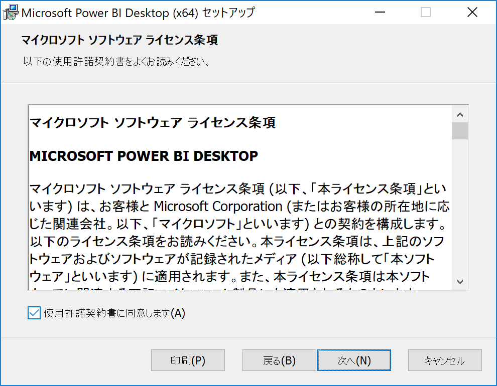
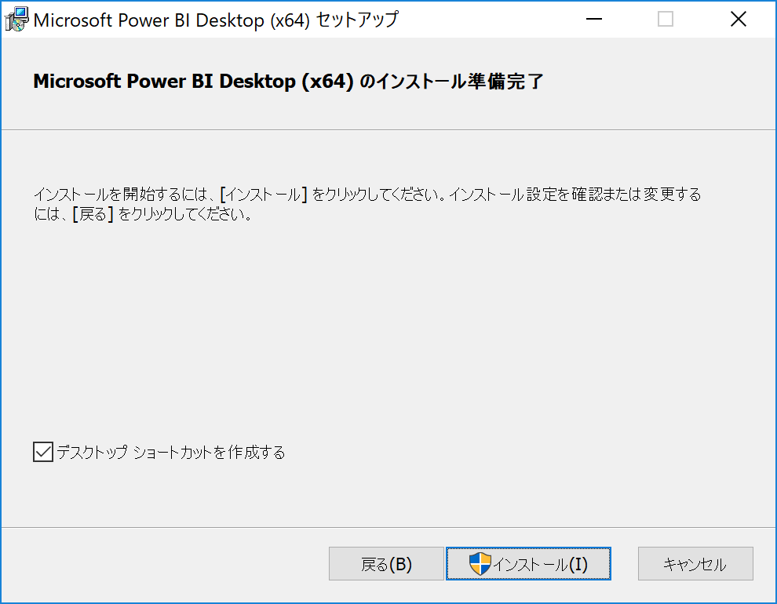
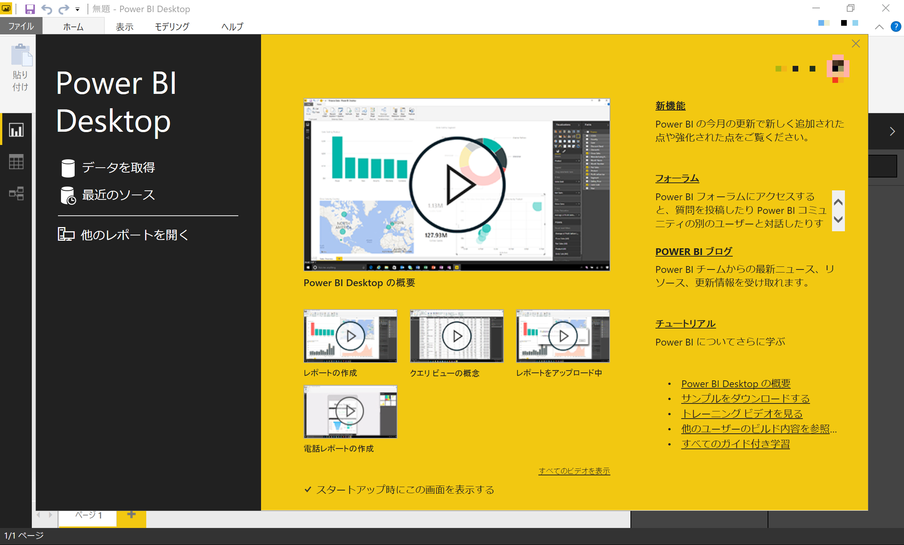
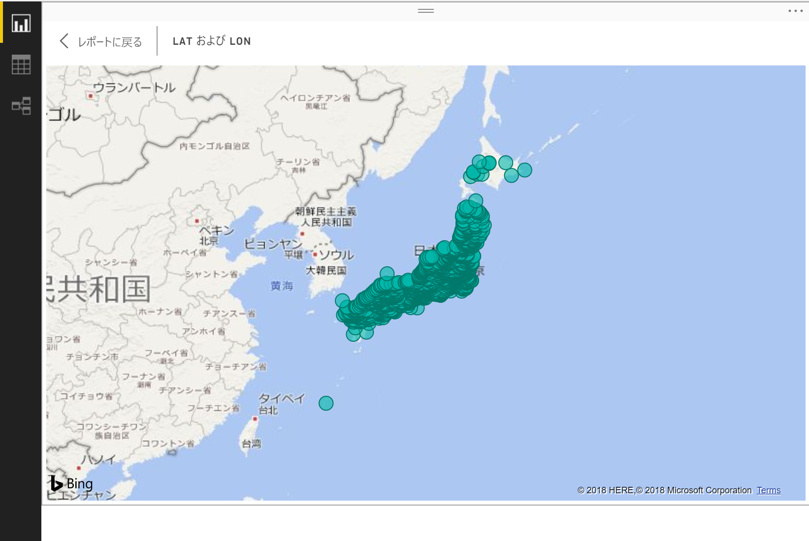
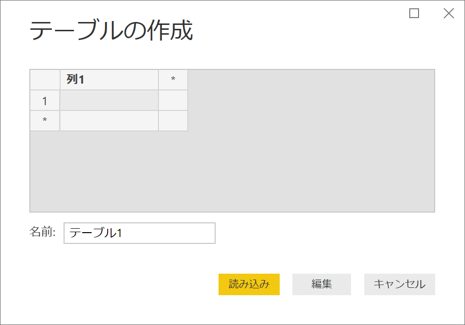
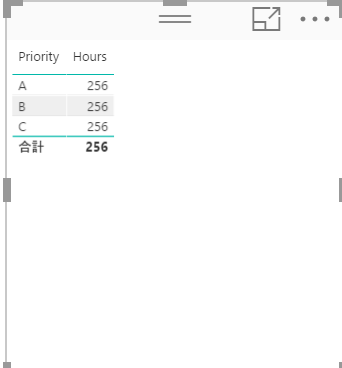
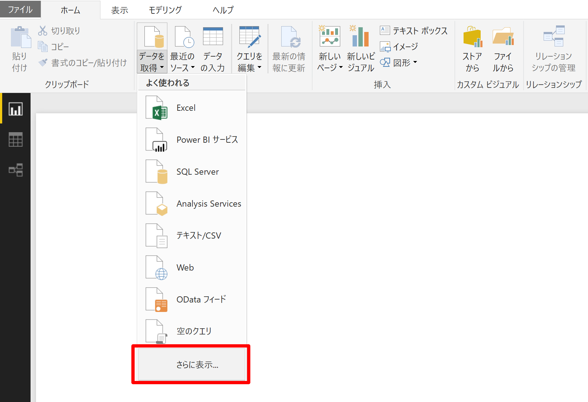

# 🔰PowerBI Desktopをさわってみた

## 🔰そもそもPowerBIとはなんぞや

PowerBIはMicrosoftが提供するBIツール。
今回使うPower BI Desktopはフリーで利用する事が出来ます。

ちなみに2017年12月現在下記の製品があるようです。

| name                   | Description                                                                                                                                        |
| :--------------------- | :------------------------------------------------------------------------------------------------------------------------------------------------- |
| Power BI (Service)     | SaaSで提供されるPowerBI。ブラウザから利用する。                                                                                                    |
| Power BI Desktop       | Windowsデスクトップにインストールして動作させるアプリ(無料)                                                                                        |
| Power BI Mobile Apps   | モバイルアプリ向けのPoweBI                                                                                                                         |
| Power BI Embedded      | PowerBIで作成したビジュアル、レポート、ダッシュ ボードを独自サービスに組み込む製品。2017年5月にPowerBi (Service)とのサービス統合が発表されたらしい |
| Power BI Report Server | オンプレミスサーバでPowerBIレポート等を利用するための製品                                                                                          |

Power BI (Service)には無料サービスと有料サービス(ProとPremium)が存在し。下記ページにfreeとProの違いが記載されています。

[Power BI 無料版 対 Power BI Pro](https://powerbi.microsoft.com/ja-jp/documentation/powerbi-free-vs-pro/)

ちなみにPower BI (Service)を利用する際に利用できるアカウントに制限があり。

普通のMSアカウントではPowerBi(service)は利用出来ず、Microsoftの組織アカウントじゃないとダメなようです。  

[PowerBI - サインアップに必要なもの](https://docs.microsoft.com/ja-jp/power-bi/service-self-service-signup-for-power-bi#what-you-need-to-sign-up)

組織アカウントではない普通のMSアカウントでPowerBI(Service)にサインアップしようとすると、下記のように表示される。  

▶組織アカウント以外はエラー表示  

ここらへんの事とか下記ブログ記事が分かりやすい。

[Power BI とは？ - What is Microsoft Power BI? -](https://qiita.com/yugoes1021/items/091c1732ff4b6f108877)

PowerBIって調べだすと、Saasで提供されるPower BIだったりデスクトップアプリだったり検索結果が色々と入り混じって調べづらいきがする。さらに言えばPowerBIがExcelのアドインとして提供され初めた過去の経緯とかもあって、そこら辺の情報も引っかかってきたり……

## 🔰PowerBIのドキュメント

- [Power BI ドキュメント](https://powerbi.microsoft.com/ja-jp/documentation/powerbi-landing-page/)

Power BI や Power BI Desktop　等のドキュメントがある。
基本、公式サイトに学習動画やらドキュメントやら大量にあるでここをみれ良いともう。

## 🔰PowerBI Desktopをインストール

[MS PowerBI Desktop](https://powerbi.microsoft.com/ja-jp/desktop/)

▶公式サイトのリンクからインストーラをダウンロードしてインストール。

ちなみにwebページを表示している言語のインストーラをダウンロードしてるっぽい？

▶**次へ**  

▶使用許諾契約のチェックに同意して**次へ**  

▶**次へ**  

▶**インストール**  

▶**完了**  

▶PowerBI Desktopが起動しました  

## 🔰PowerBI Desktopのマップ視覚エフェクトを使ってみる

とりえあずPowerBI Desktopのマップ視覚エフェクトを使ってみる。

ここではマップ視覚エフェクトにデータを突っ込んで、バブルマップを作ってみます。

今回、お誂え向きな清酒の酒蔵位置情報データが手元にあったのでコレを使っていきます。
(2013年頃にネット上で情報を収取して、ジオコーディングのお遊びで作ったやつ)

以下、日本酒な余談

1600箇所程度の酒蔵位置データが入っていますが、これは一昔まえのデータになります。
2018年現在、酒蔵は年々数を減らしていて。清酒製造の事業から撤退したり、倒産したり、ブランドだけ残して製造は他に委託してたり。
今現在生き残っていたり実際に醸造している所はこの数より大分少なかったりします。

日本酒に係る情報やらは国税庁のwebサイトに資料が色々とあるので興味がアレばぜひ。

余談終了

### 🔰PowerBIでcsvデータを読み込んでみる

▶**データを取得**を選択  

▶用意したcsvファイル(location.sakagura.csv)を選択  

▶今回はそのまま**読み込み**を選択  

※編集を選択すると、取り込み対象や項目のデータ型を指定してデータの読み込みが行えるようになります。

▶左端にあるデータ(赤枠)を選択すると、読み込んだテーブルを確認することが出来ます  

### 🔰PowerBIでバブルマップを設定してみる

▶左端にあるクエリ(赤枠)を選択する。  

▶視覚化パネルのマップ(赤枠)を選択する。  

▶フィールドパネルの**lat**と**lon**(緯度と経度)を選択  

csvインポート時にlatとlonを10進数で取り込んでいたので集計されているようです。
マップでは緯度と経度は集計しない必要があるようなので視覚化パネルの緯度と経度で集計しないを選択します。

▶赤枠の所を選択  

▶**集計しない**を選択  

▶マップが表示されました。  

▶完成(フォーカスモードで表示してみる)  

緯度と経度の情報があればさっくりとグラフィカルなマップが表示できますね。

## 🔰PowerBIで２つのテーブルのリレーションを張ってみる

ここでは下記ページにある、ProjectHoursとCompanyProjectのサンプルでリレーションを張ってみる。

[Power BI Desktop でのリレーションシップの作成と管理](https://docs.microsoft.com/ja-jp/power-bi/desktop-create-and-manage-relationships#adjusting-cross-filter-direction-for-a-complex-set-of-tables-of-relationships)

### 🔰ProjectHoursとCompanyProjectのテーブルを作成する

#### 🔰テーブルの作成

サンプルページにあるProjectHoursとCompanyProjectをエクセルなりcsvなりで作成してインポートでも良いですが。
PowerBI上でテーブルを直接入力する術も用意されていたりします。

直接入力する場合にはリボンにある**データの入力**からテーブルを入力する事ができます。

▶**データの入力**  

▶テーブルの作成  

▶入力して**読み込み**  

▶ProjectHoursテーブルが追加されました  

お好きな方法でProjectHoursとCompanyProjectをPowerBIに取り込んで下さい。

▶ProjectHours  

▶CompanyProject  

テーブルを見比べてみると、ProjectHours:ProjectとCompanyProject:ProjNameに似たような項目が入っておりこの項目で紐づくようです。

#### 🔰リレーションシップを使用しないでクエリを作成してみる

まずはリレーションシップを張らないで参照ページに書いてあるクエリを作成してみる。

▶視覚化パネルの赤枠の表なボタンを選択  

▶フィールドパネルで**CompanyProject:Priority**と**ProjectHours:Hours**を選択

リレーションシップを張らずに2つのテーブルを参照するクエリを作成してみました。

HoursがPriority A,B,Cがそれぞれ256となっており、ProjectHours:Hoursの総計が入っているようです。

▶それぞれ256hoursとなっている  

#### 🔰リレーションシップを使用してクエリを作成してみる。

リレーションシップを使用するとテーブルのCompanyProjectテーブルとProjectHoursがそれぞれ紐付いて、CompanyProject:Priorityの切り口でProjectHours:Hoursが集計されるようになります。

▶リボンにある**リレーションシップの管理**を選択  

▶**新規作成**を選択  

▶リレーションシップを作成の画面が表示  

▶プルダウンから対象となるテーブルを選択  

▶リレーションシップを張る項目(ProjectとProjName)を選択。  

▶リレーションシップが張られました。**閉じる**を選択  

▶先ほど作成したqueryを参照してみると、２つのテーブルが紐付いてPriorityの切り口で集計が行われていることを確認できます。  

## 🔰PowerBIでSharepoint上のxlsxファイルを読み込んでみる

PowerBIではshrepoint上の各種ファイルを読み込む事ができます。

[PowerBI Blog - Combining Excel Files hosted on a SharePoint folder with Power BI](https://powerbi.microsoft.com/ja-jp/blog/combining-excel-files-hosted-on-a-sharepoint-folder/)

▶**データを取得** -> **さらに表示**　を選択  

▶**SharePointフォルダ**を選択  

▶SharePointフォルダのサイトURL(ルート)を入力してOKを選択  

接続するのに資格情報が保存されてない場合等は下記の画面が出ます。

▶ここでは**Microsoftアカウント**を選択して**サインイン**を選択します。  

▶資格情報を入力した後に、**接続**を選択  

▶読み込めるファイルの一覧が表示される。このままだと対象が多すぎるので**編集**を選択  

▶読み込めるファイルの一覧が出力されるのでフィルタ機能を利用して対象を絞る  

▶今回は対象となるlocation.sakagura.csvをフィルタ機能で絞ります。  

下記画像のBinaryを選択すると対象列のみを読み込み。contents横のファイルの結合ボタンを選択すると表示されているファイル群を結合して読み込みます。

▶今回は**ファイルの結合**ボタンを選択してみます。  

▶**OK**を選択  

▶**閉じて適用**を選択して取込完了  

sharepoint上のデータが更新された時に、**最新の情報に更新**で更新すればPowerBI上のデータについても更新されます。

## 発行(publish)機能を利用してみる

さきほど作成したバブルマップを発行機能を利用して、PowerBI DesktopからPowerBI(Service)に発行してみます。
発行を行う事により、該当のレポートがPowerBI(Service)上に接続されて、ブラウザから操作することが出来るようになります。

▶**発行**を選択  

▶PowerBI Desktopでサインインしていない場合はサインイン画面が出てきます。  

発行する宛先が選択されます、今回はマイワークスペース

▶**マイワークスペース**を選んで**選択**  

▶発行されました。**Power BI で'sakagura.pbix'を開く**でブラウザが立ち上がってPowerBI(Service)が開きます。  

▶PowerBI(Service)上に発行されたレポートが確認出来ます。  

## 🔰総評

グラフィカルなレポートをさっくり作れたり、大きなファイルサイズでも取り回しが中々良かったりしてさわってみると結構便利です。

またPowerBI Desktopから発行という機能を利用して、PowerBI(Service)にレポートをアップロードすることもできたりするので。
これを利用してチーム間でレポートを共有等という用途でも便利かと思いました。（共有しちゃいけない物等の扱いは要注意なのは当たり前ですが……）

が、PowerBI Desktopと PowerBI(Service)という名前が、その存在を無駄に理解しづらくしていて（自分だけ？）無駄に取っ掛かりづらかったのが残念な部分。
